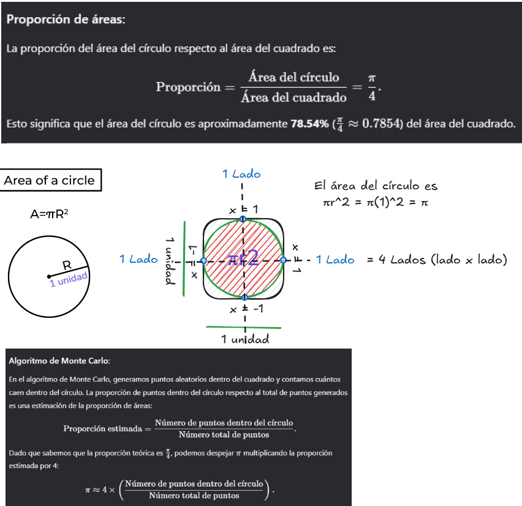
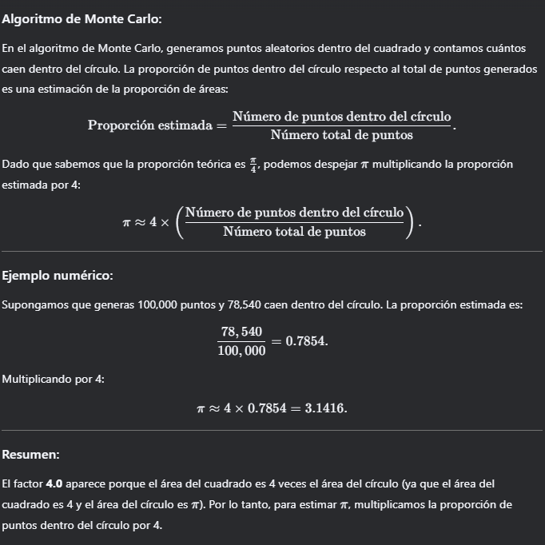

### Algoritmo de Monte Carlo
Estima el valor de PI.
La idea es generar puntos aleatorios dentro de un cuadrado y contar cuántos caen dentro de un círculo inscrito en ese cuadrado.
La proporción de puntos dentro del círculo se puede usar para estimar π.
...
la Simulación de Montecarlo es una técnica matemática que se utiliza para estimar los posibles resultados de un evento incierto.

El Método de Montecarlo fue inventado por John von Neumann y Stanislaw Ulam durante la Segunda Guerra Mundial para mejorar la toma de decisiones en condiciones inciertas. Debe su nombre a una conocida ciudad casino, llamada Mónaco, ya que el elemento de azar es fundamental en el planteamiento del modelo, similar a un juego de ruleta.

También proporcionan una serie de ventajas sobre los modelos predictivos con entradas fijas, como la capacidad de realizar análisis de sensibilidad o calcular la correlación de las entradas. El análisis de sensibilidad permite a los responsables de la toma de decisiones ver el impacto de cada variable en un resultado determinado, y la correlación les permite comprender las relaciones entre las variables de entrada.

... la simulación de Montecarlo predice un conjunto de resultados basados en un rango estimado de valores frente a un conjunto de valores de entrada fijos.

Explicacion de Algoritmo Montecarlo
